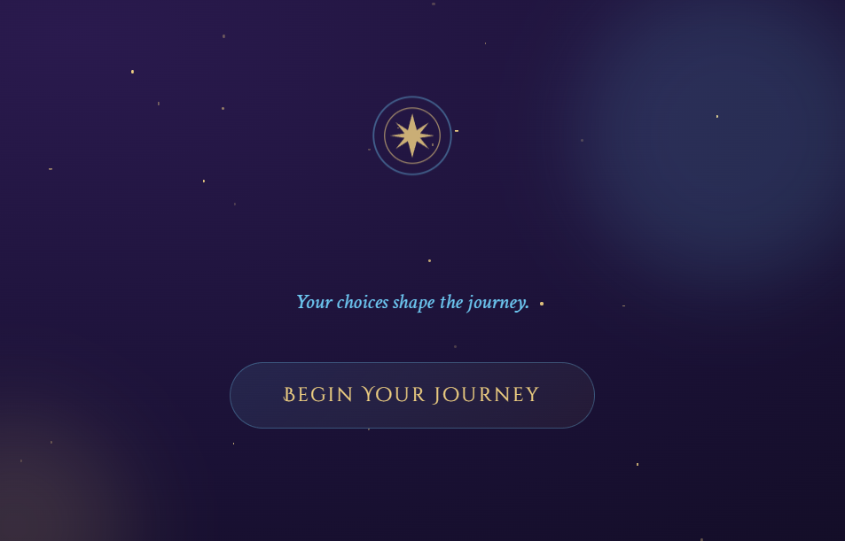
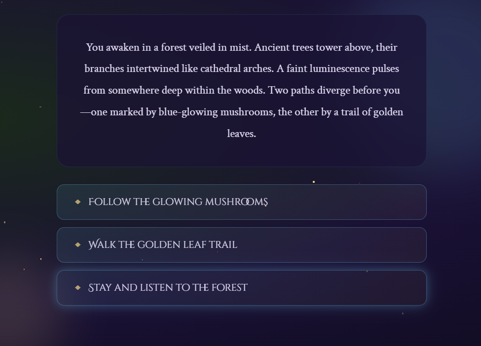
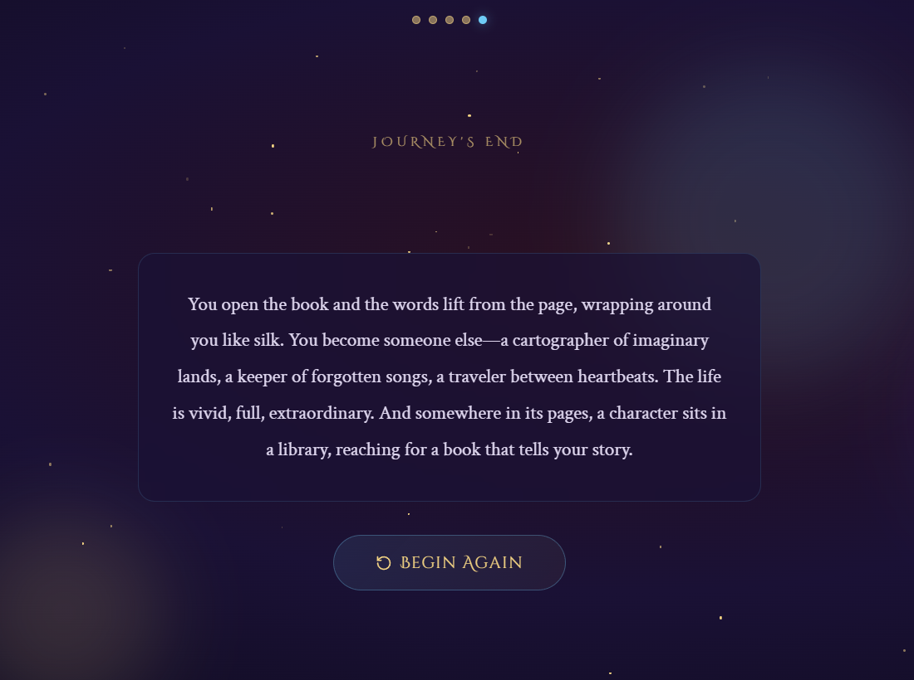

### 🌑 The Shadow Path

An interactive story-based web experience where your choices shape the journey. Explore a mysterious world filled with magic, emotions, and multiple endings.

---

### ✨ Features

• Interactive story with branching choices<br>
• Multiple unique endings<br>
• Animated background with stars and glowing orbs<br>
• Smooth transitions and immersive UI<br>
• Restart and progress tracking system<br>

---

### 🛠️ Technologies Used

• HTML<br>
• CSS<br>
• JavaScript<br>
• Tailwind CSS<br>
• Lucide Icons<br>

---

### 🚀 How to Run

1. Download or clone the project<br>
```Bash
git clone https://github.com/upasana-nayak307/Story-telling.git
```
2. Open the project folder<br> 
3. Open `index.html` in your browser<br>  

👉 No installation required (runs locally in browser)<br>

---

### 📸 Screenshots





---

### 🎮 How it Works

• Start the story<br>
• Make choices<br>
• Each choice changes the path<br>
• Reach different endings<br>

---

### 📁 Project Structure
```
Story-Telling/
│
├── index.html      # Main HTML structure
├── style.css       # Styling and animations
├── app.js          # Functionality and logic
├── image-1.png
├── image-2.png
├── image-3.png 
└── README.md       # Project documentation
```

---

### 💡 Future Improvements

• Add sound effects<br>
• Save user progress<br>
• Add more story paths<br>
• Improve mobile experience<br>

---

### 👩‍💻 Author

**Upasana Nayak**<br>
Full-Stack developer

---

### 📄 License
This project is open-source and free to use.